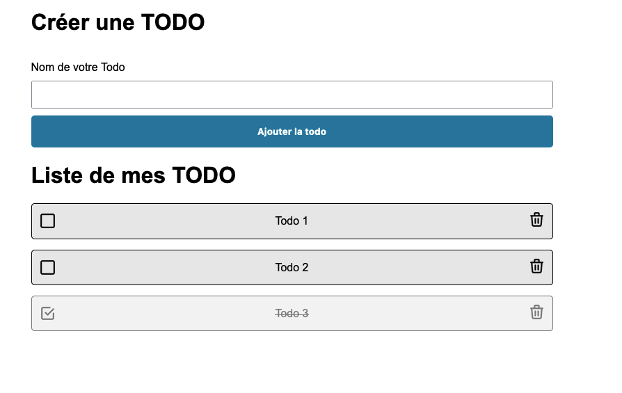
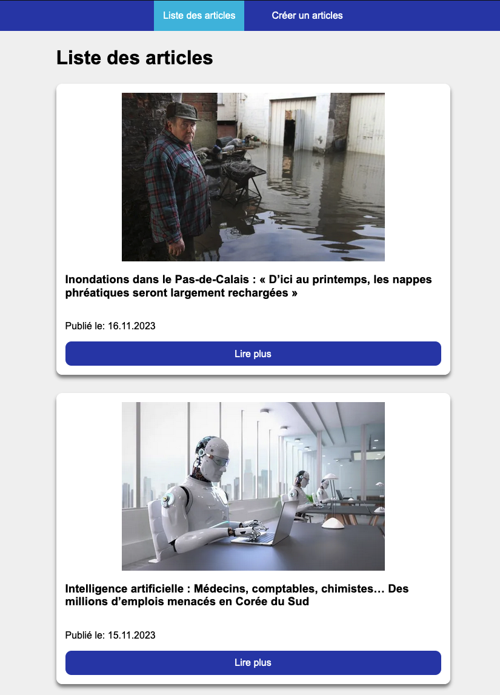
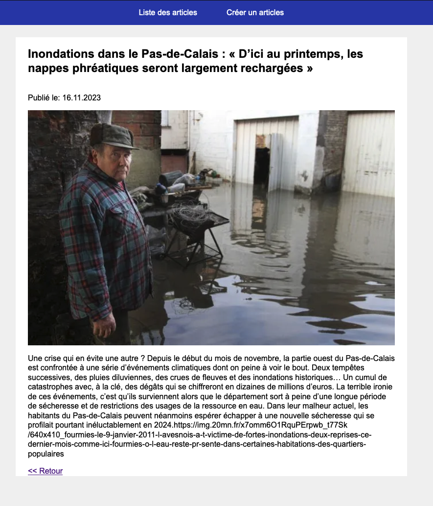
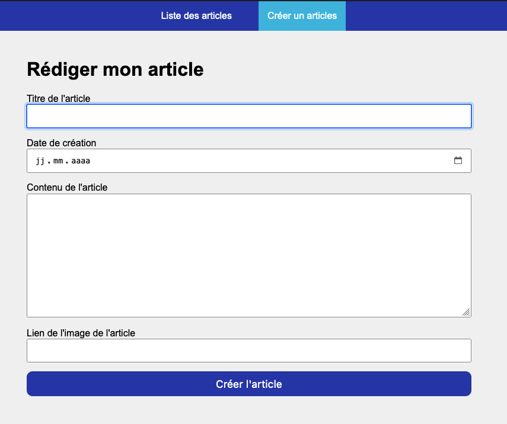
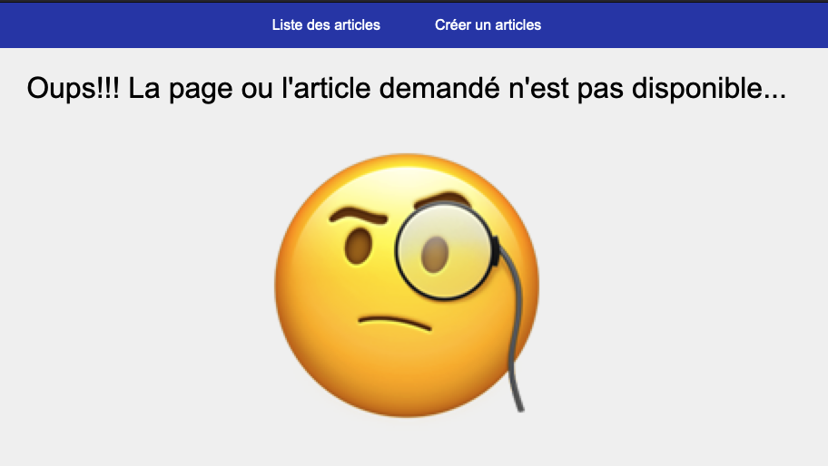

# Présentation
Ce repository contient des challenges (sur des branches différentes) pour apprendre à coder avec Angular.

Les défits peuvent être réalisé en 1h ou sur une journées et sera spécifié en haut de chaque challenge.

# Liste des challenges

## Défit 1: TODO: 1h30
Réaliser une application TODO en angular comprenant les éléments suivant:
- Utilisation des composants
- Utilisation de la nouvelle synthaxe (angular v17) @if @for
- Utilisation d'injectables
- Utilisation des @Inputs
- Utilisation des réactives forms
- Utilisation des Image optimisée

### Résultat

## Défit 2: Liste d'article: 3h
Création d'un mini site pour l'affichage et la rédaction d'article simplifié.
- Utilisation des composants
- Utilisation de la nouvelle synthaxe (angular v17) @if @for
- Utilisation d'injectables
- Utilisation des réactives forms
- Système de routing

### Résultat
Page d'accueil

Détail de l'article

Rédiger un article

Page / article non trouvé

## Défit 3: Création de facture